# AndroidResTranslator

[](https://kotlinlang.org)
[](https://www.jetbrains.com/compose-multiplatform/)
[%20%7C%20iOS-lightgrey.svg)](#支持平台)
[](./LICENSE)

[English](./README.md) · **简体中文**

**AndroidResTranslator**（应用内名 *KMP Translator*）是一款基于 **Kotlin Multiplatform** 与 **Compose Multiplatform** 的跨平台工具，面向 Android 本地化工作流：批量翻译 **`strings.xml`**、双文件对比、以及多语言 **`res/`** 目录管理，并支持进度跟踪、版本管理与导出。

**仓库地址**：[github.com/Abdulla-abs/Translator](https://github.com/Abdulla-abs/Translator)

---

## 截图

### Desktop（Windows）

| Dashboard | Files |
|:---:|:---:|
| 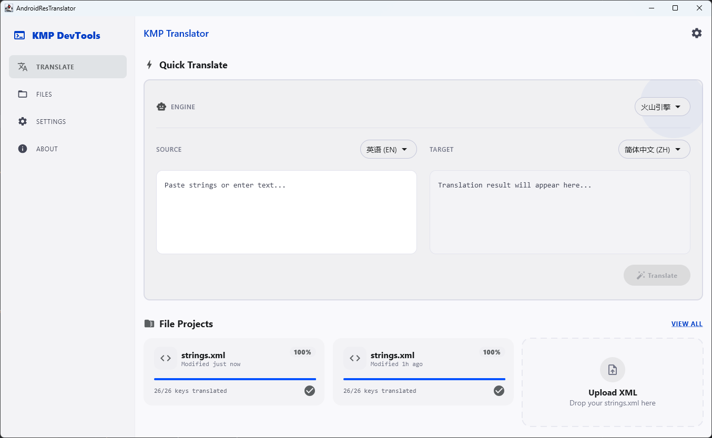 | 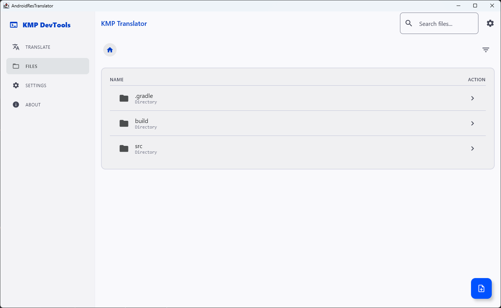 |

| About | Settings |
|:---:|:---:|
| 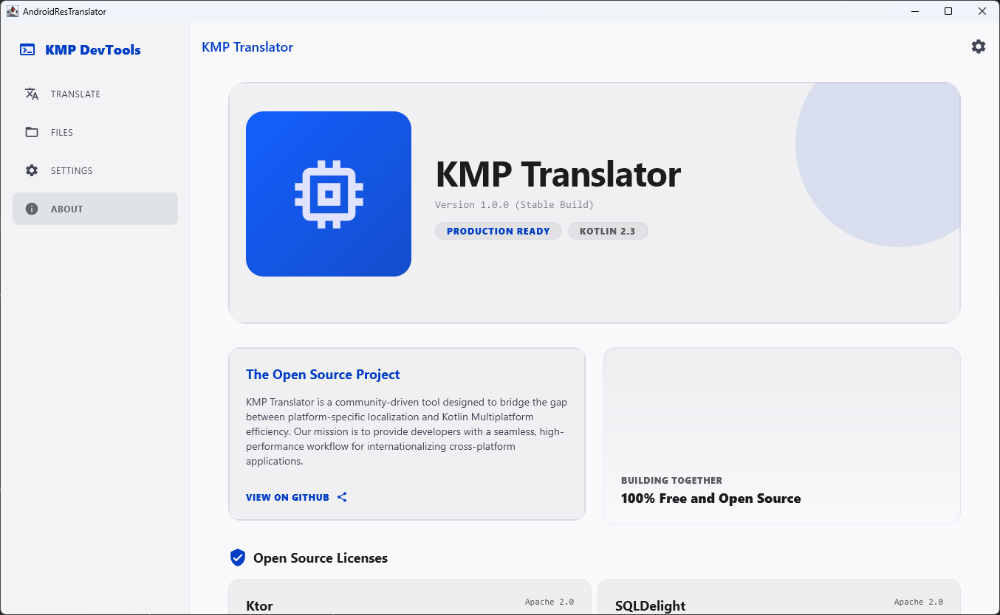 | 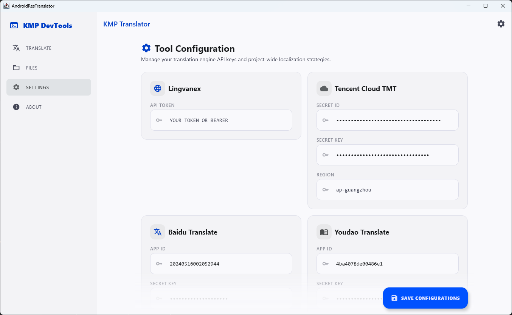 |

| 文件编辑器 | XML 对比 | 多文件导入对比 |
|:---:|:---:|:---:|
| 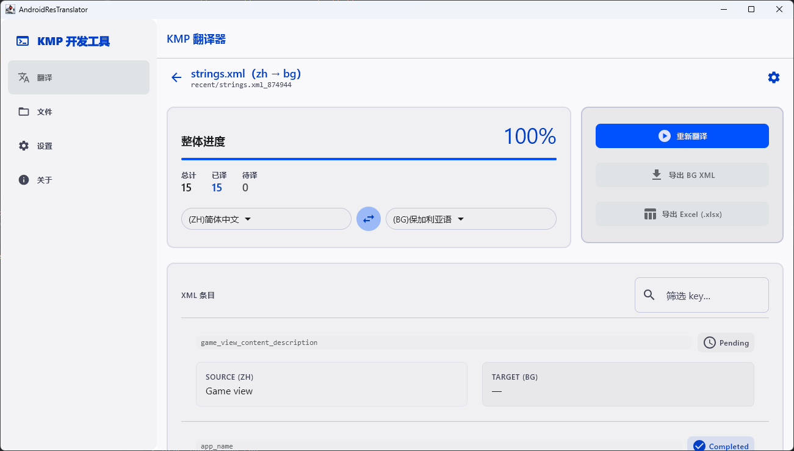 | 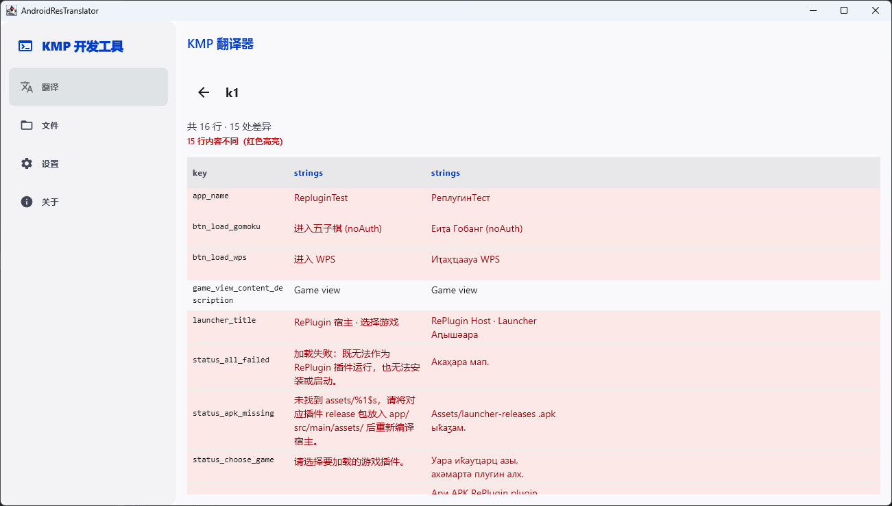 | 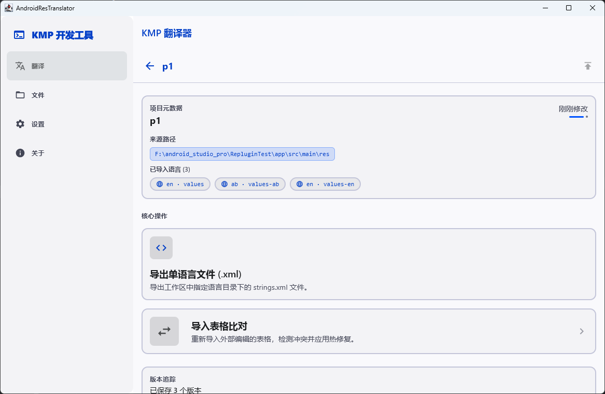 |

### Android

| Dashboard | Files |
|:---:|:---:|
| 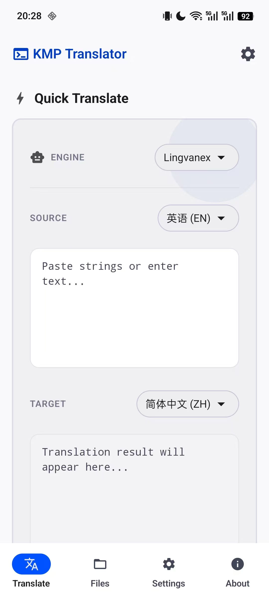 | 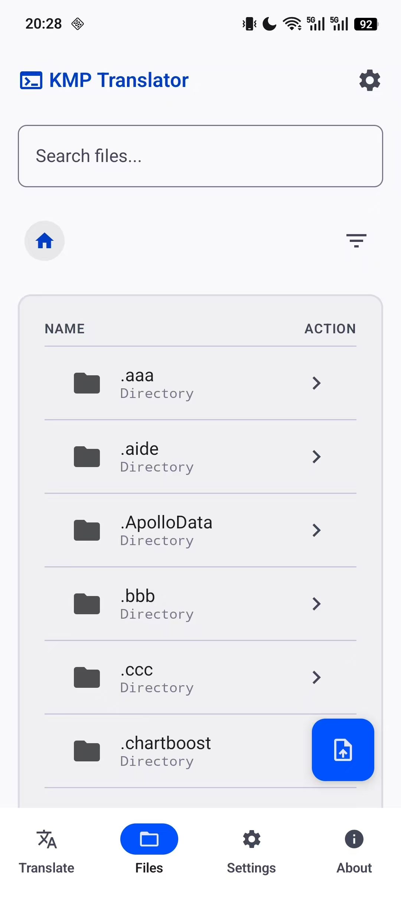 |

| About | Settings |
|:---:|:---:|
| 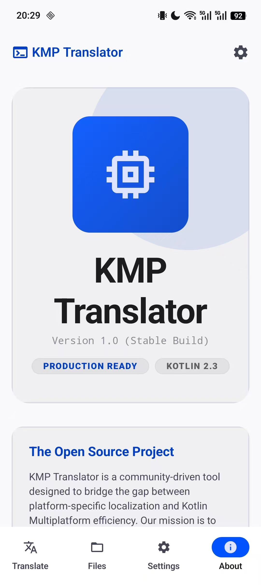 | 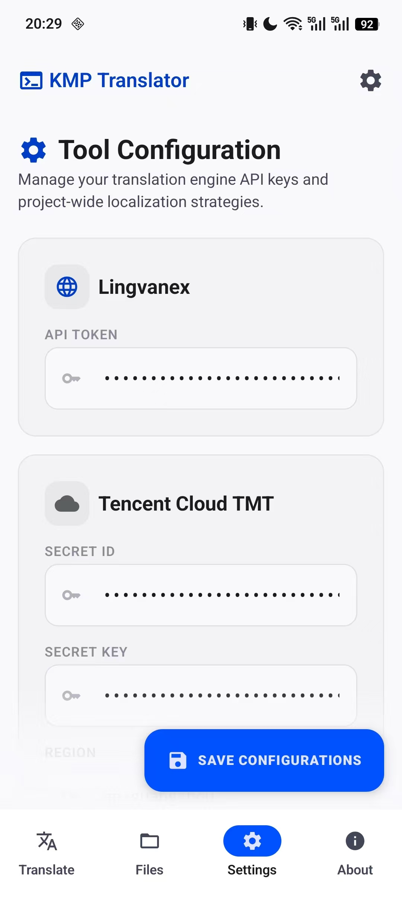 |

---

## 应用导航

应用包含四个主标签（窄屏为底部导航，宽屏 ≥768dp 为左侧固定抽屉）：

| 标签 | 作用 |
|------|------|
| **翻译 (Translate)** | 首页：快速翻译、单文件项目、XML 对比、多文件 `res` 项目 |
| **文件 (Files)** | 浏览本地目录并打开 `strings.xml` 进入编辑器 |
| **设置 (Settings)** | API 密钥、默认语言、界面语言、主题、快速翻译行为 |
| **关于 (About)** | 版本信息与开源许可 |

---

## 功能特性

### 1. 单文件翻译（File Projects）

一次批量翻译一个 **`strings.xml`**。在首页上传时选择两种工作流之一：

| 模式 | 首页上传 | 编辑器内操作 | 合并策略 |
|------|----------|--------------|----------|
| **全量 (Full replace)** | 仅源 `strings.xml` | 上传**目标** `strings.xml` 后开始翻译 | 在目标基线上覆盖/重译条目 |
| **增量 (Incremental)** | 仅源 `strings.xml` | 上传**目标基线** `strings.xml` 后开始翻译 | 仅补全目标中缺失或为空的 key |

**编辑器能力**

- 进度统计：Total / Translated / Pending / Error
- 源/目标语言选择（Android 语言码：`en`、`zh`、`zh-rTW` 等）与互换
- 按 key 筛选、单条重试、暂停/继续
- 导出就绪后可**重新翻译**（需确认）
- **导出** XML；存在失败条目时弹出确认（失败行保留源文）
- **项目设置**：强制翻译 `translatable="false"` 的条目
- 离开编辑页后翻译任务在后台继续（`FileEditorControllerStore`）

**导入方式**：点击上传卡片、拖拽 XML（桌面端），或从 **文件** 标签页打开。


### 2. 快速翻译（首页）

- 短文本试译，验证密钥与语言对
- 在快速翻译卡片上选择**首选翻译引擎**
- **自动翻译**（输入防抖后）或仅手动按钮（设置 → 翻译策略）
- 一键复制译文

### 3. 文件对比（File Compare）

并排对比**两个** `strings.xml`（不调用翻译 API）。

- 创建命名对比项目 → 分别上传文件 A、文件 B
- 粘性表格：`key` 列 + 左右译文；差异高亮
- 点击单元格复制内容到剪贴板
- 可重新上传任一侧以刷新对比


### 4. 多文件 `res` 项目（Multi-file Projects）

导入整个 Android **`res/`** 目录（`values/`、`values-en/` 等），统一管理各语言 `strings.xml`。

- **初始化**：选择包含 `values*` 子目录的 `res` 文件夹
- **导出**：完整表格（`.xlsx`），或单语言 `.xlsx` / `.xml`
- **导入表格对比**：加载 `.xlsx`，与工作区 diff，可选**应用**变更写回工作区
- **版本历史**：推送命名版本、恢复、删除版本（及后续版本）
- 工作区有未保存变更时显示 dirty 提示

> 多文件项目的批量 AI 翻译规划中；导出/导入对比/版本管理已可用。


### 5. 文件标签页

- 本地目录浏览 `strings.xml`
- 顶栏搜索框过滤项目列表
- 与首页项目共用同一套文件编辑器

### 6. 翻译服务

需在 **设置** 或根目录 **`config.properties`** 中配置至少一家厂商：

| 引擎 | 配置项 |
|------|--------|
| Lingvanex | `lingvanex.token` |
| 火山引擎 | `huoshan.accessKeyID`, `huoshan.secretAccessKey` |
| 百度翻译 | `baidu.appId`, `baidu.secretKey` |
| 有道翻译 | `youdao.appId`, `youdao.secretKey` |
| 腾讯翻译 | `tencent.secretId`, `tencent.secretKey`（可选 `tencent.region`） |

**默认编排**（无首选引擎）：火山 → Lingvanex → 百度 → 有道 → 腾讯。

**首选引擎**（快速翻译卡片或持久化设置）：文件翻译优先使用该厂商，失败时**不会**静默回退到其他厂商（避免误报「腾讯未配置」等）。

厂商语言白名单、调用链与语言码说明见 **[TRANSLATION_VENDOR.md](./TRANSLATION_VENDOR.md)**。

### 7. 设置与外观

- 各厂商 API 密钥（键名与 `config.properties` 一致）
- 新建项目的默认源/目标语言
- **界面语言**：English / 简体中文（仅应用 UI，不影响 `strings.xml` 翻译语言）
- **主题**：Classic（深色紫）、Geek Abyss、Minimalist Porcelain（浅色）
- 快速翻译：自动触发 / 仅手动按钮

### 8. 本地持久化

各类型项目保存在平台应用数据目录下：

| 类型 | 目录（相对应用数据根） | 主要文件 |
|------|------------------------|----------|
| 单文件翻译 | `translation-projects/<id>/` | `source.xml`、`target-baseline.xml`（增量）、`result.xml`、`session.json` |
| 文件对比 | `compare-projects/<id>/` | 左右两侧 XML 副本 |
| 多文件 res | `res-multi-projects/<id>/` | 工作区副本、`meta.json`、版本快照 |

**桌面 (JVM)** 默认根目录：`~/.android_res_translator/`

各类型有 `index.json` 索引；退出应用后可恢复进度、错误状态与语言设置。

---

## 支持平台

| 平台 | 状态 | 说明 |
|------|------|------|
| **Desktop (JVM)** | 推荐 | Windows / macOS / Linux，`composeApp:run` |
| **Android** | 支持 | `assembleDebug` 或 IDE 运行 |
| **iOS** | 支持 | 使用 Xcode 打开 `iosApp` 构建运行 |

---

## 快速开始

### 环境要求

- **JDK 11+**
- **Android SDK**（仅构建 Android 时需要）
- **Xcode**（仅构建 iOS 时需要，macOS）

### 克隆仓库

```bash
git clone https://github.com/Abdulla-abs/Translator.git
cd Translator
```

### 配置 API 密钥

1. 复制示例配置：

   ```bash
   cp config.properties.example config.properties
   ```

2. 编辑根目录 **`config.properties`**，填入至少一个厂商的真实密钥。

3. **切勿**将 `config.properties` 提交到 Git（已在 `.gitignore` 中忽略）。

也可在应用内 **Settings** 页面填写并保存密钥（与 `config.properties` 键名一致）。

### 运行桌面版（推荐）

**Windows**

```bat
.\gradlew.bat :composeApp:run
```

**macOS / Linux**

```bash
./gradlew :composeApp:run
```

或在 IntelliJ IDEA / Android Studio 中选择 Gradle 任务 **`composeApp` → `run`**。

### 构建 Android

```bash
# Windows
.\gradlew.bat :composeApp:assembleDebug

# macOS / Linux
./gradlew :composeApp:assembleDebug
```

### 构建 iOS

在 Xcode 中打开 [`iosApp`](./iosApp) 目录，选择目标设备或模拟器运行。

---

## 使用说明

### A. 首次配置

1. 打开 **设置** → 填写至少一家翻译厂商的 API 密钥。
2. （可选）在 **翻译策略** 中设置默认源/目标语言、界面语言、主题。
3. 在 **翻译** 页使用 **快速翻译** 验证密钥，并选择**首选引擎**。

### B. 全量翻译单个 `strings.xml`

1. **翻译** → **File Projects** → **Upload XML (Full Replace)** → 选择源 `strings.xml`。
2. 在编辑器中上传**目标** `strings.xml`（要被覆盖的现有译稿）。
3. 设置源/目标语言 → **开始翻译**。
4. 如有失败条目可单独重试 → 完成后 **导出**。

### C. 增量翻译单个 `strings.xml`

1. **翻译** → **Upload XML (Incremental)** → 选择源 `strings.xml`。
2. 在编辑器中上传**目标基线**（线上正在使用的 `strings.xml`）。
3. 应用会规划：仅翻译目标中缺失或为空的 key，已有译文跳过。
4. 开始翻译 → 导出合并结果。

### D. 从磁盘打开 XML（文件页）

1. **文件** → 浏览到工程目录 → 打开 `strings.xml`。
2. 与首页项目使用同一编辑器，适合尚未加入「最近项目」的文件。

### E. 对比两个 XML

1. **翻译** → **File Compare** → **Create compare project** → 输入名称。
2. 上传文件 A、文件 B → **Compare**。
3. 在 diff 表格中查看；点击单元格复制内容。

### F. 多语言 `res` 目录工作流

1. **翻译** → **Multi-file Projects** → 创建项目并进入。
2. **选择 res 文件夹**（包含 `values`、`values-en` 等的父目录），等待导入完成。
3. **导出完整表格** 供离线编辑，或导出单语言 `.xml` / `.xlsx`。
4. **导入表格对比** → 查看差异 → **应用** 将变更写回工作区。
5. 大改前 **推送版本**；在版本列表中 **恢复** 或 **删除** 版本。

### G. 含错误条目时导出

若存在 **Error** 状态条目，导出前会弹出确认：继续导出则失败 key 保留源文。

---

## 项目结构

```
AndroidResTranslator/
├── composeApp/                 # KMP 主模块（UI + 核心逻辑）
│   └── src/
│       ├── commonMain/         # 共享 UI、翻译编排、XML 编解码、持久化
│       ├── androidMain/
│       ├── jvmMain/            # 桌面入口 Main.kt
│       └── iosMain/
├── iosApp/                     # iOS 壳工程
├── config.properties.example   # 密钥配置模板
├── TRANSLATION_VENDOR.md       # 厂商调用链与语言码说明
└── gradle/
```

| 路径 | 职责 |
|------|------|
| `core/translation/` | `TranslationOrchestrator`、各厂商 Vendor |
| `core/resources/` | `strings.xml` 解析、规划器、批量用例 |
| `core/resources/compare/` | 双文件对比矩阵 |
| `core/resources/resmulti/` | `res/` 扫描、导出、导入对比 |
| `persistence/` | 项目目录、`session.json`、索引 |
| `ui/screens/fileeditor/` | 单文件翻译编辑页 |
| `ui/screens/main/` | 首页、快速翻译 |
| `ui/screens/compare/` | XML 对比项目 |
| `ui/screens/resmulti/` | 多文件 `res` 项目 |

---

## 开发与测试

```bash
# 运行单元测试（commonTest + jvmTest）
./gradlew :composeApp:jvmTest

# 仅编译 JVM / iOS（Windows 使用 gradlew.bat）
./gradlew :composeApp:compileKotlinJvm :composeApp:compileKotlinIosSimulatorArm64
```

测试中使用 `FakeSecretsProvider` 注入假密钥，**不依赖**本机 `config.properties`。

可选：JVM 实网冒烟测试需 `-Dlive.vendor.smoke=true` 及环境变量（见 `LiveVendorSmokeJvmTest.kt`），CI 默认不触网。

调试翻译链路时，可在 Run 控制台查看 `[AndroidResTranslator]` 前缀日志；通过 `TranslationDebugLog.enabled = false` 关闭。

---

## 常见问题

**Q: 已配置 Lingvanex，仍提示腾讯未配置？**  
A: 在快速翻译卡片（或设置）中选择 **Lingvanex** 为首选引擎，并使用最新代码（首选厂商失败时不再回退到未配置厂商）。

**Q: Lingvanex 返回 “bind a payment method”？**  
A: 这是 Lingvanex 账户计费问题，需在 [Lingvanex](https://lingvanex.com) 控制台绑定支付方式，与语言码无关。

**Q: 退出应用后卡片显示已完成，但条目未翻译？**  
A: 旧版本可能将未译条目误写入 `result.xml`。新版本已修复持久化逻辑；若遇旧数据，请对该项目执行「重新翻译」或重新导入源文件。

**Q: 增量项目无法开始翻译？**  
A: 请先在编辑器中上传**目标基线** `strings.xml`；增量模式必须先有目标文件才能翻译或导出。

---

## 安全提示

- API 密钥仅保存在本机（`config.properties` 或应用设置存储），请自行保管，不要提交到公开仓库。
- 翻译请求会发送到您配置的第三方厂商服务器，使用前请阅读各厂商服务条款与计费说明。

---

## 贡献

欢迎提交 Issue 与 Pull Request。提交前请：

1. 运行 `./gradlew :composeApp:jvmTest` 确保测试通过  
2. 不要包含 `config.properties` 或任何真实密钥  
3. 大型改动请先开 Issue 讨论

---

## 相关文档

- [README.md](./README.md) — English documentation  
- [TRANSLATION_VENDOR.md](./TRANSLATION_VENDOR.md) — 翻译厂商调用链与语言支持  
- [config.properties.example](./config.properties.example) — 配置项说明  

---

## 许可证

本项目采用 **[MIT License](./LICENSE)** 开源。

Copyright (c) 2026 abbas

您可以自由使用、修改与分发本软件，但须保留版权声明与许可全文。详见 [LICENSE](./LICENSE) 文件。

---

## 致谢

基于 [Kotlin Multiplatform](https://kotlinlang.org/multiplatform/)、[Compose Multiplatform](https://www.jetbrains.com/compose-multiplatform/)、[Ktor](https://ktor.io)、[xmlutil](https://github.com/pdvrieze/xmlutil) 等开源项目构建。
