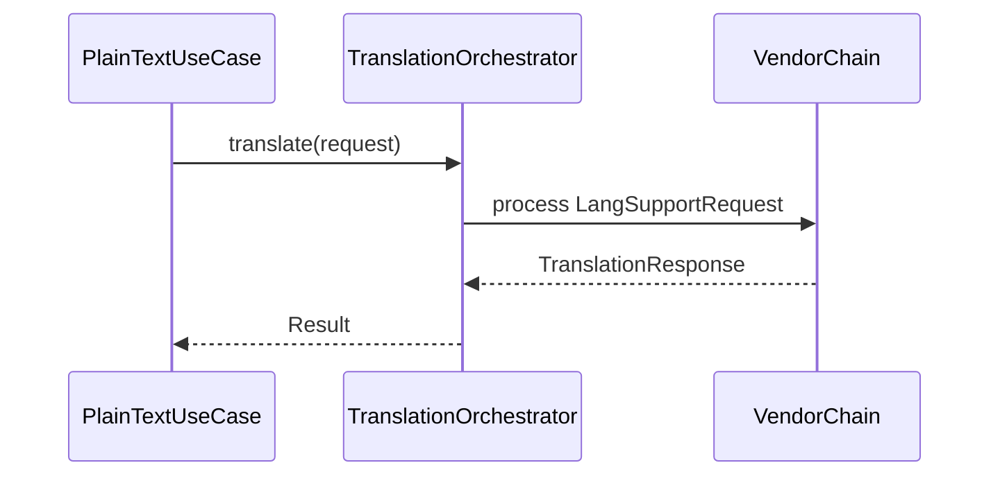
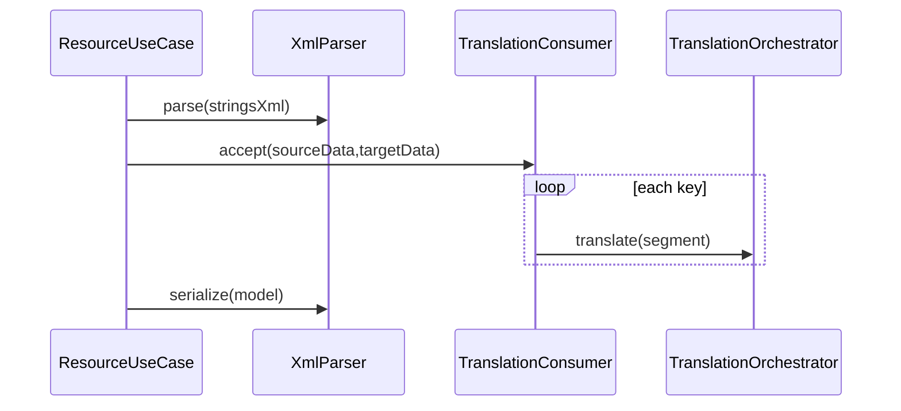

# android_trans → KMP 第一阶段架构迁移设计说明

**文档类型**：架构 / 阶段一范围设计（无 UI 实现）  
**日期**：2026-05-14  
**关联仓库路径**：根目录 [android_trans](../../android_trans/)，目标模块 [composeApp](../../composeApp/)  
**上游产品结论**（已定调）：全平台 **通用翻译** 与 **strings.xml / res 增值能力** 分层；阶段一只交付 **与 UI 解耦的核心**，可测、可对齐旧行为。

---

## 1. 背景与目标

### 1.1 现状

- **android_trans**：Java Gradle 工程，依赖 dom4j、jxl、OkHttp、Gson、腾讯云 Java SDK、火山 Java SDK 等；入口以 [`Dom4j`](../../android_trans/src/main/java/org/example/dom4j/Dom4j.java) 内控制台逻辑为主，[`MainFrame`](../../android_trans/src/main/java/org/example/ui/MainFrame.java) 为未完成的 Swing 壳。
- **AndroidResTranslator**：Kotlin Multiplatform，`composeApp` 含 `androidMain`、`iosArm64` / `iosSimulatorArm64`、`jvmMain`，当前业务几乎为空模板。

### 1.2 阶段一（本说明范围）要达成的目标

| 目标 | 说明 |
|------|------|
| G1 | **通用翻译**：单段文本经多厂商责任链得到结果，语义与旧版 `TranslationManager` + 各 `*Translation` 等价或可解释的差异。 |
| G2 | **res/XML 核心**：`strings.xml` / `string-array` 解析为内存模型、Filled / AllReplace 等 Consumer 行为、跳过与强制翻译规则与旧版一致。 |
| G3 | **对齐与差异**：在内存模型上实现按 key 对齐、缺失/多余/值不同等结构化结果（不依赖阶段二 UI）。 |
| G4 | **可验证**：`commonTest` / `jvmTest` + golden XML/属性样例；**不**要求阶段一上线图形界面。 |
| G5 | **为阶段二留白**：文件选择、拖拽、Compose 仅通过 **清晰接口**（如 `expect` 文件源、`TranslationConfigPort`）依赖核心，核心不反向依赖 UI。 |

### 1.3 阶段一明确不包含

- Compose 页面、导航、平台拖拽与 SAF 完整接线（属阶段二）。
- XLS 互转（jxl 强 JVM，可作为 **阶段 1.5** 或独立里程碑；本设计仅预留接口或 `expect` 导出钩子）。
- 将旧工程 **原样** 以 Java 堆进 `jvmMain` 作为长期形态（允许极短期对照分支，不作为终态架构）。

---

## 2. 方案对比与已定稿

### 2.0 已定稿（负责人确认）

| 项 | 结论 |
|----|------|
| **总体技术路线** | **方案 A**：`commonMain` 内 **Kotlin 核心** + **Ktor Client + 各厂商 HTTP REST**（kotlinx.serialization）+ **多平台 XML 库** 读写 `strings.xml`；**不**以 dom4j / 官方 Java SDK 作为阶段一终态依赖。 |
| **三端目标** | Android / Desktop / iOS **共享**同一套翻译链与 XML 管线实现（与方案 A 一致）。 |

### 方案 A — 「common 优先」（**已采用**）

- **做法**：`commonMain` 内重写各厂商为 **HTTP REST**（Ktor Client + kotlinx.serialization）；XML 使用 **多平台 XML 库** 读写 `resources`/`string`/`string-array`。
- **优点**：三端一致、长期技术债最低。
- **缺点**：阶段一工作量大；需逐厂商对照旧 SDK/示例请求（签名、错误码、限流）。

### 方案 B — 「JVM 优先」（**未采用**，仅作历史对比）

- Android + Desktop 用 dom4j + Java SDK；iOS 分裂或 stub。与已定稿 **冲突**，不再作为阶段一方向。

### 方案 C — 「混合」（**未采用**，仅作历史对比）

- 文本 REST + XML 仅 JVM。与已定稿 **冲突**，不再作为阶段一方向。

---

## 2.1 D1–D5 负责人决策记录（已委托实现侧）

负责人对 D1–D5 **均不单独指定产品偏好**，授权实现按 **主流技术栈** 与 **本项目阶段一目标（方案 A、可测、可对齐旧行为语义）** 选型并写入后续小版本修订。

| # | 主题 | 负责人意见 | 实现侧准则（与此前「建议默认」对齐，作为执行底线） |
|---|------|------------|--------------------------------------------------------|
| D1 | 多平台 XML 库与边角策略 | **不表态** | 原工程 **dom4j / jxl 无 KMP common 能力**；阶段一 **strings 管线不得依赖 dom4j**。在 `commonMain` 选用 **社区主流、维护活跃、适合读写 Android `strings.xml` 子集** 的 KMP XML 方案；**jxl** 仍仅用于 **阶段 1.5 / XLS**，与 D1 解耦。预研后在本 spec 修订记录或 `README` 中 **写明所选库名与版本** 及已支持/未支持的 XML 形态。 |
| D2 | XML golden 对齐粒度 | **不表态** | 采用 **语义等价 + 稳定规范化**；golden 断言以解析后模型或规范化文本对比为主，避免无意义的空白/属性序抖动。 |
| D3 | 厂商链顺序与里程碑 | **不表态** | **链顺序与旧版一致**（火山 → Lingvanex → 百度 → 有道 → 腾讯）；允许 **分里程碑接通子集**，接口一次设计完整，文档标明当前已接通厂商。 |
| D4 | CI 是否调用真实 API | **不表态** | **CI 默认 Mock + golden**；真实 endpoint 仅本地/可选流水线 job，且密钥不入库。 |
| D5 | 多 key 并发 | **不表态** | **默认串行**；预留可配置并发上限，默认关闭直至有明确限流与压测结论。 |

**已由方案 A 关闭、与 D1–D5 无关的项**：是否在 common 使用 REST、三端是否共享核心等（见 §2.0）。

---

## 3. 推荐目标架构（逻辑模块）

### 3.1 分层（与方案 A 对齐）

```
commonMain
├── core.translation      # 厂商链、语言支持、Post/Response、Ktor HTTP、kotlinx.serialization
├── core.text             # 通用翻译用例（仅依赖 translation）
├── core.resources        # Strings 内存模型、多平台 XML 解析/序列化、Consumer、对齐/差异
└── core.ports            # FileSystem / Secrets / Clock 等 expect（阶段一最小化）

androidMain / jvmMain / iosMain
    # 仅实现 ports（如密钥读取、真实文件系统）；**不**承载 dom4j 或 Java 翻译 SDK 作为业务终态
```

### 3.2 依赖规则

- `core.resources` **仅依赖** `core.translation`（调用「译一句」）与不可变模型；**不**依赖 Android / `java.io.File` 的具体类型；目录遍历通过 **port** 注入（阶段一测试可提供 fake in-memory file tree）。
- `core.text` **仅依赖** `core.translation`。
- `core.translation` **不依赖** `core.resources`（避免环）。

### 3.3 与旧 Java 包映射（迁移清单）

| 旧包 / 类 | 阶段一归宿 |
|-----------|------------|
| `translation.*`（Manager、Handler、Bean、Consumer 抽象） | `core.translation` + `core.resources`（Consumer 实现侧） |
| `*_*translation`（各厂商） | **`commonMain` 内 Kotlin + REST** 重写；旧 Java 仅作对照参考，不进入终态依赖 |
| `Dom4jDocUtil`、`StringsXMLData` | `core.resources.model` / `parser`（**多平台 XML**，非 dom4j） |
| `Dom4j` 中 orchestration | `core.resources.usecase`（如 `TranslateValuesFolder`） |
| `TranslationKeyReader` | 接口 `SecretsProvider` + 各端 `actual`（阶段一测试可用 map） |
| `StringXmlOutput` / `Jxl2Dom4j` | **阶段一外**；可记 `ResourceExportPort` TODO |

### 3.4 数据流（概念）

**通用翻译**



**单 XML / 整包（阶段一核心）**



---

## 4. 关键接口（建议命名，实现阶段可微调）

| 接口 / 用例 | 职责 |
|-------------|------|
| `TranslationOrchestrator` | 等价 `TranslationManager.translation`，入参出参 Kotlin 数据类。 |
| `LangSupportChain` | 等价责任链，可测试「某目标语落到哪一厂商」。 |
| `TranslatePlainTextUseCase` | 输入原文、源/目标语言代码，返回译文字符串或结构化错误。 |
| `AndroidStringsRepository`（或 parser 组合） | 读写字符串资源内存模型；**基于多平台 XML 库**，不依赖 dom4j。 |
| `TranslationConsumer`（Kotlin sealed / interface） | Filled / AllReplace 等策略；与旧 `AbsTranslationConsumer` 行为对齐。 |
| `ResourceDiffAnalyzer` | 多份 `StringsXMLData` 或 Map 输入 → 差异列表。 |
| `FileTreePort` / `BinarySourcePort` | 阶段一向用例注入「虚拟文件树」；阶段二由平台实现。 |

---

## 5. 错误处理与并发

- **网络**：超时、重试次数、厂商错误体解析为 **密封类** `TranslationError`（配额、不支持语言、鉴权失败、未知），**不**在核心层 `printStackTrace` 了事。
- **写盘**：旧版 `ExecutorService` 异步写未 join 的问题在阶段一 **禁止** 复现；写操作要么同步在 IO dispatcher 边界完成，要么返回 `Deferred`/`suspend` 由调用方明确等待（阶段二 UI 再挂协程）。
- **并发翻译**：是否并行请求多 key 由用例层策略控制；默认保守 **串行 + 可配置并发上限**，避免触发厂商限流。

---

## 6. 测试策略（阶段一验收）

| 类型 | 内容 |
|------|------|
| 单元 | Consumer 规则表（跳过、强制、空目标节点新增 string-array item 等） |
| Golden | 最小 `strings.xml` 输入 → 期望输出 XML 文本（Filled / AllReplace 各至少一例）；对齐 **§2.1 D2** 约定 |
| 合同 | Mock `TranslationOrchestrator` 固定返回值，验证 Consumer 写回次数与文本 |
| 集成（可选 jvmTest） | 嵌入真实配置文件副本（**脱敏**）对沙箱 endpoint 跑一次冒烟（CI 可 skip） |

---

## 7. 风险与缓解

| 风险 | 缓解 |
|------|------|
| REST 与旧 Java SDK 行为不一致 | 逐厂商用旧工程样例做 **对照测试**；文档记录已知差异。 |
| 多平台 XML 对 `strings.xml` 边角形态支持不足 | **§2.1 D1** 预研 + 首版声明支持的子集；golden 覆盖旧仓库真实样例。 |
| 阶段一工期膨胀 | **§2.1 D3** 允许链上厂商分里程碑交付；接口一次设计完整。 |
| 旧代码隐式依赖 `commons-lang3` 等 | 新 Kotlin 代码不依赖该路径；若短期对照运行旧 JAR，Gradle 显式声明。 |
| 密钥误提交 | 仅 `*.example` 进仓库；`SecretsProvider` 测试用 fake。 |

---

## 8. 修订记录

| 版本 | 日期 | 说明 |
|------|------|------|
| 0.1 | 2026-05-14 | 初稿：brainstorming 后的阶段一架构与范围 |
| 0.2 | 2026-05-14 | **已定稿方案 A**；重写 §2/§3.1/§3.3/§4/§7/§9；新增 **§2.1 待决策表**（D1–D5） |
| 0.3 | 2026-05-14 | 负责人对 D1–D5 **均不表态**；§2.1 改为 **委托实现侧** 并写明 dom4j/jxl 与方案 A 的边界；§9 更新 |
| 0.4 | 2026-05-14 | D1 落地：阶段一 XML 选用 **io.github.pdvrieze.xmlutil** `core`/`serialization` **0.91.1**；HTTP 客户端为 **Ktor** **3.0.3**（`commonMain` + 各端 engine）；修订记录固化版本号供 CI/依赖审计对齐。 |

---

## 9. 下一步（非本文件执行）

- **D1–D5** 已由负责人 **整体委托** 实现侧按 **§2.1** 表格执行；首版技术选型落地后，通过 **spec 修订记录** 或仓库 `README` 固化库名与行为边界。
- 可单独产出 **可执行任务列表**（例如引用 `writing-plans` 技能生成实现计划）。
