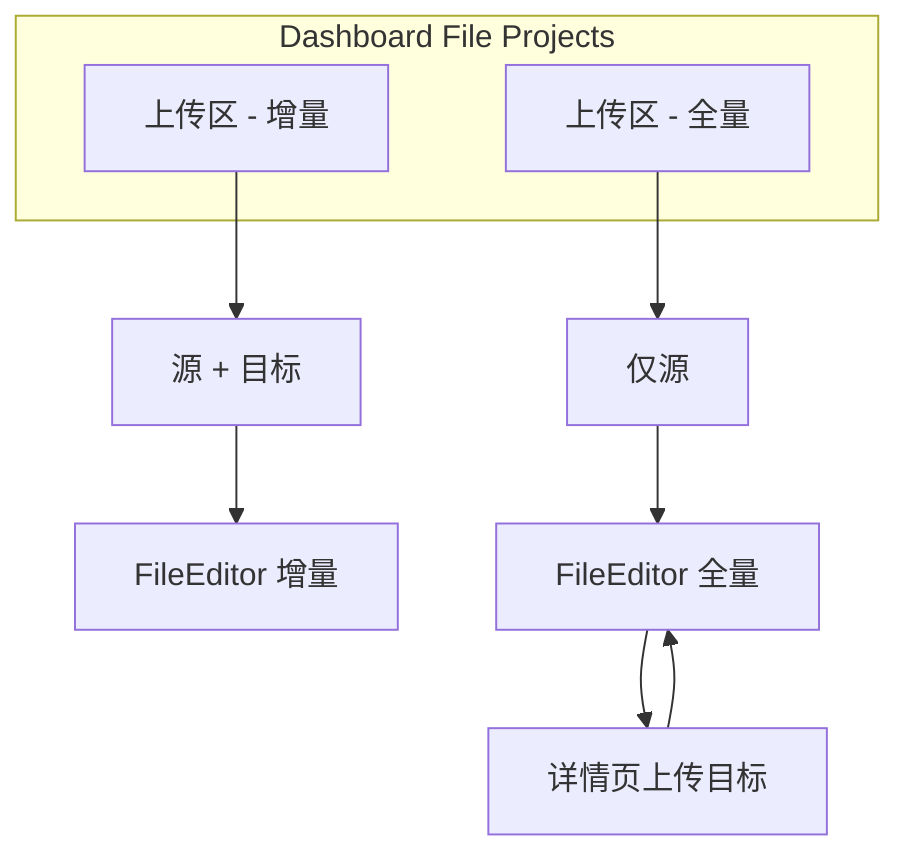

# 增量 / 全量翻译模式 — 架构与 UI/交互设计

**文档类型**：产品 / 架构 / 交互  
**日期**：2026-05-21  
**状态**：已确认（产品决策 2026-05-21）  
**依赖**：[阶段一核心 spec](./2026-05-14-android-trans-phase1-design.md)、[file_page 设计](./2026-05-19-file-page-design.md)  
**关联实现**：`FilledTranslationConsumer`、`AllReplaceTranslationConsumer`、`FileEditorScreen`

---

## 1. 背景与问题陈述

### 1.1 业务新增

**增量翻译**：用户选择 **源 + 目标** 两份 `strings.xml`；以源 key 为准，目标中 **缺 key** 或 **同 key 值为空** 的条目翻译，**非空保留**。

**全量翻译**：用户选择源文件；进入工作台后 **再上传目标文件**；对已对齐槽位按源文 **全部重译并覆盖**（`AllReplace` 语义）。

### 1.2 现状盘点

| 模块 | 当前行为 | 差距 |
|------|----------|------|
| **FileEditor** | 单 `source.xml`，条目全 `Pending` | 未区分全量/增量；无目标文件流 |
| **TranslateFileTab** | 粘贴双 XML + 设置页 `consumerMode` | **删除**（产品决策） |
| **设置 → 合并策略** | 全局 FILLED / ALL_REPLACE | **删除 UI**；策略改由项目 `workflowMode` 绑定 |
| **FilledTranslationConsumer** | 缺 key 才译；array 整段跳过 | 需支持 **空 value**、**array 按 item 增量** |

---

## 2. 目标与非目标

### 2.1 目标

- Dashboard **两个并列上传区**：上 = 增量，下 = 全量（见 §6.2）。
- 工作台 `workflowMode` 绑定 Consumer：**增量 → Filled**，**全量 → AllReplace**（不可在设置里改）。
- `string` / `string-array` **item 级**增量规则落地（含目标 array 已存在但部分 item 为空）。
- 删除 `TranslateFileTab` 及设置页「合并策略」区块。
- 复用 `FileEditor` 进度、导出、会话持久化。

### 2.2 非目标

- `values-xx` 目录批量翻译 UI 改造（内部默认 `Filled` 即可）。
- 单条内联编辑译文。
- 保留 TranslateFileTab 或设置页全局合并策略。

---

## 3. 已确认产品决策（2026-05-21）

| # | 议题 | 决策 |
|---|------|------|
| 1 | `string-array` 目标已有 array、部分 item 为空 | **是**，按 **item 增量**（本里程碑纳入） |
| 2 | 主页上传入口 | **不弹模式选择**；**上方区域 = 增量**，**下方新增同等区域 = 全量** |
| 3 | 全量创建时文件 | 拖/选文件仅作 **源**；**目标在翻译详情页再上传** |
| 4 | TranslateFileTab | **删除**（非隐藏） |
| 5 | 合并策略与设置页 | 删除设置中的合并策略 / TranslateFileTab 相关项；**全量项目固定 AllReplace，增量项目固定 Filled** |
| 6 | 旧项目迁移 | 无 `workflowMode` 字段的历史项目 → 视为 **FULL** |

---

## 4. 领域规则

### 4.1 术语

| 术语 | Consumer | 含义 |
|------|----------|------|
| **增量翻译** | `FilledTranslationConsumer` | 缺 key / 空值 → 译；非空 → 跳过 |
| **全量翻译** | `AllReplaceTranslationConsumer` | 源中可译槽位一律重译覆盖 |

### 4.2 `string` 规则

```
需翻译 ⇔ 目标无 key  OR  target.value.isBlank()
跳过   ⇔ 目标有 key 且 value.isNotBlank()
```

### 4.3 `string-array` 规则（已确认按 item）

```
若目标无此 array name → 按源新建，各 item 按 item 规则处理

若目标已有此 array：
  对每个源 item 下标 i：
    需翻译 item ⇔ 目标无该下标  OR  目标 item.isBlank()
    跳过 item     ⇔ 目标该下标非空
  输出 array 长度 = 源 items.size（与现 AbsTranslationConsumer 一致）
```

**核心改动**：`shouldTranslateStringArray` 不可因「目标已有 array」而整段跳过；改为 `target == null || 存在任一需译 item`。

```kotlin
// 示意
fun shouldTranslateStringArray(source, target): Boolean =
    target == null || source.items.indices.any { i ->
        shouldTranslateStringArrayItem(source.items[i], target.items.getOrNull(i))
    }

fun shouldTranslateStringArrayItem(sourceItem, targetItem): Boolean =
    targetItem == null || targetItem.isBlank()
```

### 4.4 `IncrementalTranslationPlanner`（commonMain）

与 `FilledTranslationConsumer` 共用同一套 slot 判定（抽 `IncrementalSlotPolicy` 避免分歧）。

- **增量项目**：`loadIncremental(source, target)` → `Pending` / `Skipped`。
- **全量项目**：目标未上传前不生成可译列表；上传目标后 `loadFull(source, target)` → 凡可译 `string` 均为 `Pending`（AllReplace 语义，无 Skipped，除非 `translatable=false`）。

---

## 5. 架构设计

### 5.1 策略绑定（取代设置页 consumerMode）

| `TranslationWorkflowMode` | Consumer | 设置页可配置 |
|---------------------------|----------|--------------|
| `INCREMENTAL` | `FilledTranslationConsumer(forceTranslation=…)` | 否 |
| `FULL` | `AllReplaceTranslationConsumer(forceTranslation=…)` | 否 |

`AppSettingsSnapshot.consumerMode`：**从设置 UI 移除**；持久化字段可废弃或仅用于旧配置迁移（读取后忽略）。  
`TranslateValuesFolderUseCase`：调用方写死 `FilledTranslationConsumer`（批量目录补全场景）。

**删除**：`TranslateScreens.kt` 中 `TranslateFileTab` 及一切路由引用。

### 5.2 数据模型

**`TranslationWorkflowMode`**：`INCREMENTAL` | `FULL`

**`RecentXmlProject` 扩展**

| 字段 | 说明 |
|------|------|
| `workflowMode` | 创建入口决定，不可在编辑器内切换 |
| `targetDisplayName` | 目标文件名（上传后填充） |
| `hasTargetBaseline` | 是否已有 `target-baseline.xml` |

**磁盘布局**

```
projects/<id>/
  source.xml
  target-baseline.xml   # 增量：创建时写入；全量：详情页上传后写入
  result.xml
  session.json
```

### 5.3 FileEditorController

| 模式 | 创建后 | 目标文件 | 初始化 |
|------|--------|----------|--------|
| `INCREMENTAL` | 源+目标已齐 | 已有 | `loadIncremental` → Pending + Skipped |
| `FULL` | 仅源 | **详情页上传** | 无 target 时展示引导；上传后 `loadFull` → 全 Pending |

**全量详情页（无 target）**：顶部 **Banner**（非阻塞列表浏览，但 **禁止开始翻译**）：

> 全量翻译需要目标文件作为合并底稿。请上传已有的目标语言 `strings.xml`，将在此基础上覆盖重译。

操作：**上传目标 XML** 按钮 → `XmlFileAccess.launchPickXml` → 写入 `target-baseline.xml` → `loadFull`。

**翻译 / 导出**：两种模式均要求 `hasTargetBaseline == true` 后才可「开始翻译」与「导出」。

### 5.4 分层（不变）

UI → `FileEditorController` / `TranslationProjectRepository` → `Planner` + `TranslationConsumer` → `TranslationSegmentPort`。

---

## 6. UI / 交互设计

### 6.1 Dashboard「File Projects」双上传区

Bento 网格末尾改为 **两个** Upload 卡片（视觉样式相同，文案区分）：

| 位置 | 模式 | 拖放 / 点击行为 | 创建项目 |
|------|------|-----------------|----------|
| **上（现有 Upload XML）** | **增量** | 依次选择 **源**、**目标**（拖入多个 xml 时：第 1 个为源，第 2 个为目标；仅 1 个则提示再选目标） | `workflowMode=INCREMENTAL`，立即写入 `source` + `target-baseline` |
| **下（新增 Upload XML）** | **全量** | 拖/选 **1 个** 文件作源 | `workflowMode=FULL`，仅 `source.xml`；`hasTargetBaseline=false` |

文案示例（i18n 键待实现）：

- 上：`上传 XML（增量）` /  hint：`选择源与目标文件，仅翻译缺失或空条目`
- 下：`上传 XML（全量）` / hint：`选择源文件，在详情页上传目标后覆盖翻译`

**预检（仅增量）**：双文件选完后、进编辑器前 Toast/行内摘要：`待译 N · 跳过 M`。

**不采用**：单次上传弹窗选择模式。



### 6.2 Files Tab

- FAB / 打开 XML：与 Dashboard **一致**，需选择进入哪条上传链路，或按上下文默认增量（**开放实现细节**：Files 打开本地 xml 默认 `INCREMENTAL` + 二次选目标，与 Dashboard 上区相同）。
- 删除任何指向 `TranslateFileTab` 的 Detail 占位。

### 6.3 FileEditor 工作台

**顶栏**

- Badge：`增量` | `全量`
- 文件：`源: xxx.xml`；`目标: yyy.xml` 或 `目标: 未上传`（全量）

**进度区**

| 统计 | 增量 | 全量 |
|------|------|------|
| Skipped | 有 | 无（恒 0） |
| Pending / Translated / Error | 有 | 有 |

**全量 + 无目标**：显示 §5.3 Banner + 上传按钮；列表可展示源条目预览（均为 Pending，灰色「等待目标文件」）— **或** 列表为空仅 Banner（实现取更简单者，推荐仅 Banner + CTA，不预加载条目）。

**推荐**：无 target 时不 `load` 条目，仅 Banner；上传后一次性 `loadFull`。

### 6.4 设置页

**删除**：

- `SettingsStrategiesCard` 内 **合并策略**（`MergeStrategyRow` / 增量·覆盖二选一）
- 与 `consumerMode` 相关的持久化 UI

**保留**：

- 默认源/目标语言、界面语言、主题、`forceTranslation`、厂商密钥等

`forceTranslation` 仍同时作用于 Filled / AllReplace。

### 6.5 平台：文件选择

| 场景 | Desktop |
|------|---------|
| 增量上传区 | 连续两次 FileDialog，或一次拖入两个文件 |
| 全量上传区 | 一次 FileDialog / 单文件拖入 |
| 全量详情页 | 一次 FileDialog 上传目标 |

---

## 7. 测试策略

| 项 | 内容 |
|----|------|
| Consumer | `Filled`：空 string、array 部分空 item；`AllReplace`：覆盖非空 |
| Planner | 与 Consumer 规则一致 |
| FileEditor | 全量无 target 不可开译；上传后可译；增量 Skipped 计数 |
| UI | 双上传区创建不同 `workflowMode` |

---

## 8. 实施分期

| 阶段 | 交付 |
|------|------|
| **P0** | `IncrementalSlotPolicy` + `Filled`/`AllReplace` array 规则 + 测试 |
| **P1** | 删除 `TranslateFileTab`、设置合并策略 UI；`workflowMode` + 持久化 |
| **P2** | Dashboard 双上传区 + 增量双文件创建流 |
| **P3** | FileEditor 增量/全量 load、Skipped、全量 target Banner |
| **P4** | Files Tab 对齐、i18n、README |

---

## 9. 附录：删除与迁移清单

| 删除/变更 | 路径/说明 |
|-----------|-----------|
| `TranslateFileTab` | `TranslateScreens.kt` |
| 设置「合并策略」UI | `SettingsComponents.kt` → `MergeStrategyRow` 等 |
| `AppSettingsSnapshot.consumerMode` UI 绑定 | 字段可保留不展示或下版本移除 |
| 设置页 consumerMode 文案 | `settings_merge_*` 字符串可废弃 |

| 迁移 | 行为 |
|------|------|
| 旧项目无 `workflowMode` | 按 `FULL` 处理；无 `target-baseline` 时走全量 Banner |

---

**下一步**：使用 `writing-plans` 生成 `docs/superpowers/plans/2026-05-21-incremental-translation-implementation.md`。
